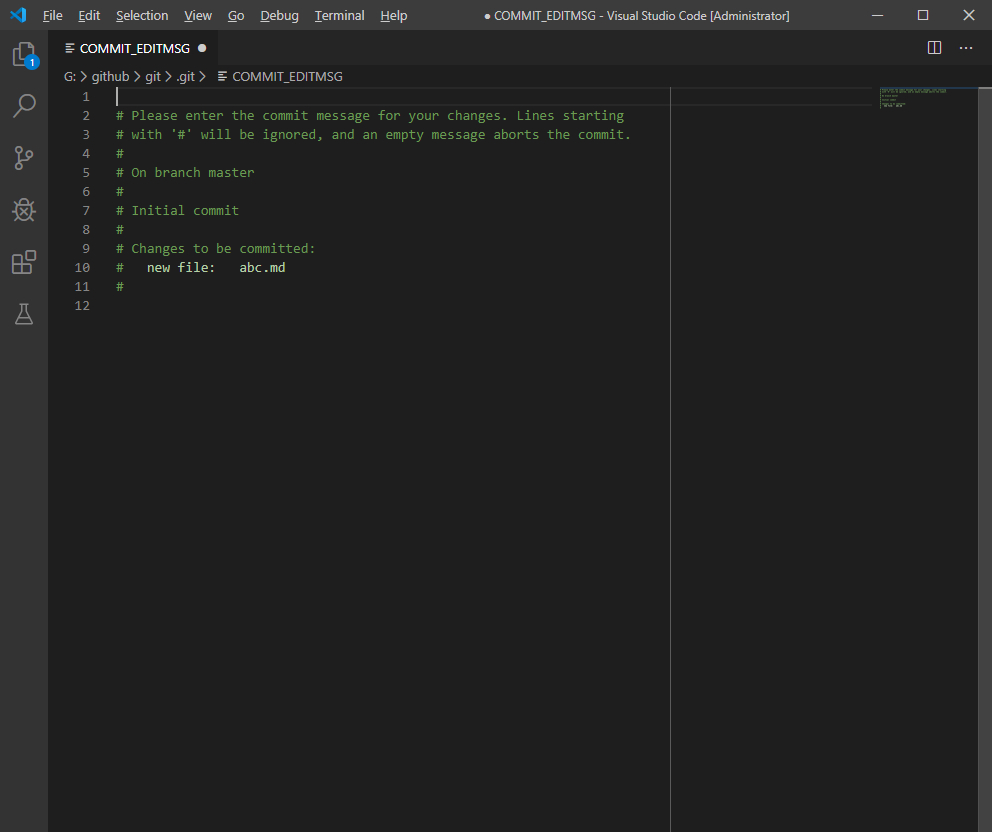
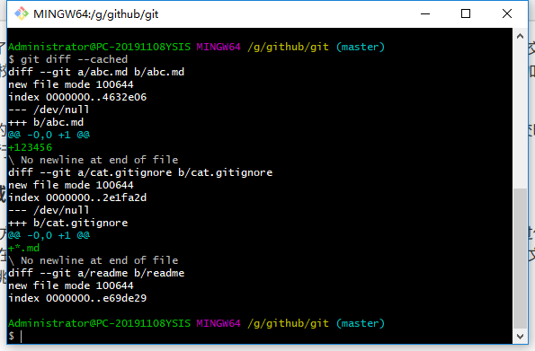
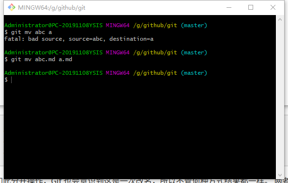

[TOC]

# 一、git简介


*注：官方logo下载在https://git-scm.com/downloads/logos*

[git](https://git-scm.com/)是一个免费的开源的分布式版本控制系统，可以快速高效的处理小型到大型项目的所有内容。

git是 [Linus Torvalds]([https://baike.baidu.com/item/%E6%9E%97%E7%BA%B3%E6%96%AF%C2%B7%E6%9C%AC%E7%BA%B3%E7%AC%AC%E5%85%8B%E7%89%B9%C2%B7%E6%89%98%E7%93%A6%E5%85%B9/1034429?fr=aladdin](https://baike.baidu.com/item/林纳斯·本纳第克特·托瓦兹/1034429?fr=aladdin)) 为了帮助管理 Linux 内核开发而开发的一个开放源码的版本控制软件。关于git的诞生可以在[廖雪峰的官方网站](https://www.liaoxuefeng.com/wiki/896043488029600/896202815778784) 或[git简史]([https://git-scm.com/book/zh/v2/%E8%B5%B7%E6%AD%A5-Git-%E7%AE%80%E5%8F%B2](https://git-scm.com/book/zh/v2/起步-Git-简史))看到。

git易于学习，功能强大。它远远高出[Subversion](http://subversion.apache.org/)、[CVS](http://www.nongnu.org/cvs/)、[Perforce](https://www.perforce.com/)和[ClearCase](https://www.ibm.com/us-en/marketplace/rational-clearcase)之类的[SCM](https://baike.baidu.com/item/scm/2039966?fr=aladdin)工具，并且具有本地分支，方便的暂存区和多工作流等功能。

## 1.关于

### 分支与合并

真正使git能够从其它SCM工具中脱颖而出的功能是分支

git允许鼓励有多个彼此完全独立的本地分支，可以执行的操作：

实际数据的更改是不可变的，而分支是对快照的索引，速度更快。

* 自由的上下文切换：分支和合并
* 基于角色的代码行：不同分支的不同影响
* 基于特征的工作流：功能受分支影响
* 用后即弃的实验：分支删除不影响主分支


---

### 小而快速

git几乎所有操作都在本地执行，与集中式版本控制需要网络速度相比更快。

git在linux内核上构建，可以有效处理大型存储库，git用c语言编写，速度和性能是git的主要设计目标

git最慢的操作是初始克隆操作，需要下载整个历史记录，而不是最新版本。

git在整个项目的整个历史记录具有每个文件的版本，但是客户端的数据大小由于压缩和存储数据的效率几乎不变。

---

### 分布式

可以实现无限数量的工作流，多重备份

分布式版本控制

* 服务器和本地是相同的副本
* 用户之间可以相互协作，即没有中央服务器，都是独立的版本数据库。


---

集中化的版本控制

* 版本控制数据库只能在中央服务器上并且只有一个
* 可以由多个用户检出不同的版本到本地进行修改。
* 检出的数据可以是快照或者数据


---

本地版本控制

在版本库中项目文件版本通过整体复制来保存不同的版本，检出的文件修改后做为新的版本放入版本数据库，旧版本之间可以检出即重新复制，但是原始版本不可修改，即版本控制数据库内的数据只能写入不能修改，且有大量的重复资源，占用空间大。

版本库会采用快照方式，以文件变更的方式进行存储，而不是完整的存储相同的内容，这样更进一步。

本地版本历史与服务器版本历史可以完全复制，或者只是其中一部分。


---

### 暂存区

与其他系统不同，Git具有称为“暂存区”或“索引”的名称。这是一个中间区域，可以在完成提交之前对提交进行格式化和检查。

使Git与其他工具区分开的一件事是，可以快速暂存某些文件并提交它们，而无需在工作目录中提交所有其他修改的文件，也不必在提交期间在命令行中列出它们。


这使您只能暂存已修改文件的一部分。在意识到忘记提交其中一个文件之前，对文件进行两个在逻辑上不相关的修改的日子已经一去不复返了。现在，您可以暂存当前提交所需的更改，并暂存下一次提交的其他更改。此功能可根据需要扩展到文件的许多不同更改。

当然，如果您不想要这种控制，Git还可以轻松忽略此功能-只需在commit命令中添加“ -a”，以将对所有文件的所有更改添加到登台区域。


---

# 二、安装Git

git官网https://git-scm.com/ 可以获取在线教程、官方pdf教程文档以及git相关工具等。

git源存储库https://github.com/git/git

git可安装在mac os x、windows、linux/unix系统上。git for windows（msysgit）与git是不同的项目

---

[下载git](https://git-scm.com/download/)版本2.24.1.2 64位版本，双击安装。


---

Git是GNU通用公共许可证版本2（[GPLv2](https://www.gnu.org/licenses/old-licenses/gpl-2.0.html)）涵盖的开放源代码项目


---

选择要安装的组件

* 在桌面添加icon图标
* 在windows右键快捷键加入集成**git bash here**和**git GUI here**
* 添加[git大文件支持](https://git-lfs.github.com/)
* 用默认文本编辑器关联.git配置文件夹
* [Bash](https://www.gnu.org/software/bash/)关联.sh文件
* 在windows控制台使用[truetype字体](https://docs.microsoft.com/en-us/typography/truetype/)
* 为git的windows版本每日检查更新


---

选择git的默认编辑器

* [vim](https://www.vim.org/)是git的默认编辑器，现在已经不推荐使用了。
* [Notepad++](https://notepad-plus-plus.org/)
* [visual studio code](https://code.visualstudio.com/)
* [visual studio code insider](https://code.visualstudio.com/insiders/)相当于bate版本
* [sublime text](https://www.sublimetext.com/)
* [Atom](https://github.com/atom/atom)


这里选择visual studio code作为默认编辑器。


---

设置PATH环境

* 仅在git bash命令行使用：不会影响现有path
* git 命令行和第三方软件（推荐）：git bash、命令提示符、windows powershell可以找到git的path
* 在命令提示符和可选的unix工具中使用git：会覆盖windows的工具路径，unix和windows有重名工具


---

选择[HTTPS](https://baike.baidu.com/item/https/285356?fr=aladdin)传输后端

* 使用[OpenSSL](https://www.openssl.org/)库
* 使用本地[windows安全通道](https://docs.microsoft.com/zh-cn/windows-hardware/drivers/display/communicating-through-a-secure-channel)库


这里选择openssl

---

配置结束转换的行

* **检查**换行格式为windows格式，**提交**为unix换行格式

git检查文本时会将**LF**替换为**CRLF**，提交文件时会将CRLF替换为LF，交叉平台项目建议设置在windows

* 检查不做替换，提交时转化为unix换行格式

git在检查时不做转换，提交文件时CRLF替换为LF，交叉平台项目建议设置在unix,core.autocrlf设为input

* 不对换行格式转换

git不会再检查和提交时对**换行符**替换，不建议在交叉平台项目上选择，core.autocrlf设为false


这里选择windows格式的换行

不同平台下结束符差别，配置不对会出错，[参考](https://my.oschina.net/moooofly/blog/228467)

 Windows 使用回车CR\r和换行LF\n两个字符来结束一行，而 Mac 和 Linux 只使用换行LF一个字符

---

配置git bash的终端模拟器

* mintty（[MSYS2](http://www.msys2.org/))的默认终端）

git bash 使用[mintty](http://mintty.github.io/)作为终端模拟器，mintty支持可变窗口大小，非矩形选择和unicode格式，windows控制台程序，如交互的python程序必须在mintty通过winpty启动，winpty使mintty终端具有交互性

* windoes自带的控制台

即cmd.exe,可以很好适应windows32位系统控制台程序，如[python](https://www.python.org/)、[node.js](https://nodejs.org/en/)。但是默认限制stroll-back回滚,需要配置使用[unicode](http://unicode.org/main.html)格式才能正确显示非[ASCII](https://www.iana.org/assignments/character-sets/character-sets.xhtml)编码格式,在windows10之前不允许自由调整字体大小，只允许矩形文本选择。


这里选择mintty

---

配置额外的选项

* 允许文件系统缓存

文件系统数据会被批量读，特定操作会在内存上缓存数据(core.fscache设置为true)，可以有效提升速度。

* 允许[git凭证管理器](https://github.com/Microsoft/Git-Credential-Manager-for-Windows)

windows版本的git凭证管理器提供安全windows的git凭证保存，最著名的多重身份验证被github和visual studio 支持，需要,NET framework v4.5.1以上。

* 允许[符号链接](https://github.com/git-for-windows/git/wiki/Symbolic-Links)

允许符号链接（需要secreatesymmboliclink许可）通过设置声明已存在的仓库不会被影响


默认选择前两个选项

---

配置实验选项（前沿特性）

* 使用实验性功能，内置 add -i/-p命令

使用实验性功能内置交互命令add(git add -i或git add -p),这会使启动更快，但是目前还不健壮。


---

点击安装

从cmd或者右键git bash here出现的mingw64，输入`git`回车会弹出git的一些命令消息


在mingw64输入mintty会弹出选项选择一个终端


# 三、安装GUI

[GUI客户端](https://git-scm.com/downloads/guis)

使用GUI客户端不需要命令行的键入，更友好、更智能。

选择目前比较流行的[github桌面](https://desktop.github.com/)windows64位，注册github

# 四、git基本操作

### git三种状态

### 更新git

git升级本质也是git clone将最新版本的git下载到本地

选择一个空文件夹，右键`git bash here`，在终端键入

```git clone git://git.kernel.org/pub/scm/git/git.git```

将会出现git文件夹，子文件夹包含.git文件夹，该方法速度较慢建议在官网直接下载最新版安装替换


### 配置git

git config --global user.name "用户名字"  
git config --global user.email 123@132.com  
git config --global core.editor vim

使用--globa选项只需运行一次，需要对项目做特殊配置则在项目目录下使用无--global选项的命令配置

### 检查配置信息

git config --list或使用git config <key>对某一项配置检查，如：git  config user.name

config文件包含特定配置选项， 

### 获取帮助

git help <verb>  
git <verb> --help  
git help config获取config命令的手册，以浏览器打开或者git config --help

### 初始化git仓库

想要对现有项目进行管理，在该项目目录使用git bash here并键入

**git init**  创建了.git文件子目录，该目录含有初始化git仓库的所有必须文件，无论git文件夹中有无文件都会提示相同信息，但是如果已经存在了.git文件夹，会提示重新初始化存在的git仓库在G://github/git/.git文件夹中，如果对文件添加了跟踪或者提交，git init不会影响这个状态，即如果有.git文件夹git init操作将不会做任何动作。

也可以**git init 文件夹名称**会在当前目录下新建文件夹，新文件夹的子目录有.git目录，命令行提示知道。

.git目录记录所有git存储和操作，若想备份复制一个版本库只需要把这个目录拷贝

* 初始化空git仓库在G://github/git/.git文件夹中
* description文件仅供gitweb程序使用
* config文件包含项目配置
* info目录包含一个全局性排除（global exclude ）文件，用以放置不放在.gitignore文件中的忽略模式
* hooks文件夹包含客户端或服务器的钩子脚本（hook scripts）
* HEAD文件指示被检出的分支
* 待创建的index文件保存暂存区信息
* objects目录存储所有数据内容
* refs目录存储指向数据（分支）的提交对象的指针


想要克隆别人的项目需要使用git clone命令，git支持多种数据传输协议，包括https://协议和git://协议，SSH传输协议，GitHub在仓库主页选择clone or download即下载或clone本质是一样的  


可以选择open in deesktop会自动clone下载，或选择下载zip压缩文件，或选择复制https协议的URL或SSH协议


完成后会在clone的目录下出现仓库名称的文件夹

### 文件跟踪及忽略

查看文件状态使用git status

刚初始化仓库git init 后除了.git文件夹和里面的内容之外没有其他文件，

键入git status 可以看仓库的状态

* 一个master分支
* 尚未提交
* 没有东西可以提交（新建或复制文件，使用git add跟踪）


**echo "# 标题" >  abc.md** 建立**文件名.类型**，并输入内容。

这时候仓库就有了一个新的文件叫abc.md里面的内容是“# 标题”，和.git属于同一个文件夹

键入git status查看此时该仓库的状态

* 一个master分支
* 尚未提交
* 没有跟踪的文件：使用git add包含将要提交的文件abd.md，红色字体显示，
* 没有任何已跟踪文件可以提交但是没有跟踪的文件存在（使用git add 跟踪）


该文件没有被添加到跟踪的状态，跟踪状态的文件指加入到版本控制的文件，跟踪的文件不存在上次快照记录中，初次克隆仓库时候，工作目录的所有文件都属于已跟踪状态。

若键入git add abc没有添加类型将会报错

* 找不到文件，abc没有匹配任何文件


git add <file.type> 加入到暂存区，将文件名和类型显示填写

虽然出现了警告，LF换行会被代替CRLF回车+换行，但是输入git status 查看仓库状态发现文件已经添加到跟踪状态即暂存区中，等待提交。

* 一个master分支
* 尚未提交
* 有变化待提交：即在暂存区中尚未提交（使用git rm --cache <文件名>从暂存区中移除）


我们试一试git rm --cache abc 不输入文件类型

提示：fatal: pathspec 'abc' did not match any files

说明依然需要输入完整的文件名.类型

git rm --cache abc.md

提示：rm 'abc.md'

git status

* 即成功把暂存区文件abc.md移除，并现在是非跟踪状态。


再把该文件跟踪，可以使用git add *或者git add .跟踪当前目录下所有文件

键入git commit将会使用默认编辑器打开一个文件.git/COMMIT_EDITMSG

* 请对你的更改输入提交信息，每一行以#开头会被忽视，一个空的信息阻止了提交
* 一个master分支
* 初始提交
* 有变化待提交
* 新文件：abc.md



对文件修改后保存文件并退出编辑器，若直接点x推出visual code会临时保存一个副本，即使将原文件删除也存在该副本，如果将.git文件和abc.md删除重新初始化仓库并新建文件，git commit将会出现之前的文件COMMIT_EDITMSG内容，这是visual code的副本内容。未保存状态文件名有黑点。

git status也会出现这样信息：nothing to commit ,working directory clean没有提交的，工作目录干净

文件的状态变化周期：


创建.gitignore文件。

#表示注释，每一行指定一个忽略规则，并且忽略规则有[优先级参考](https://www.cnblogs.com/kevingrace/p/5690241.html)

*。[oa] 忽略以.o或.a结尾的文件。星号匹配零个或任意多个字符

*~ 忽略以波浪线结尾的文件。

！123.txt 除了123.txt跟踪之外其它文件都忽略，！表示取反。

忽略规则扩展<https://github.com/github/gitignore>

 ### 查看尚未暂存的文件更新那些部分

git diff比较的是工作目录中当前文件和暂存区快照之间的差异，或者git diff --cached   |   git diff --staged



### 提交

git commit -m'描述目的'


若已跟踪内容修改后未跟踪而提交，则提交的是之前的副本。

git checkout -- 文件名.类型   撤销提交，返回上一次提交状态。

git commit -a将未跟踪文件同时跟踪add和提交commit


###  克隆已有仓库

http://协议

git clone <url>

git clone <url>  别名

git://协议

ssh协议

### 检查当前文件状态

git status  
git status -s 新添加未跟踪文件？？，暂存区文件A，修改过文件M在左边未跟踪，右边已跟踪，

git status --short  

git diff 比较当前文件和在暂存区文件的差异，即修改后未跟踪最新文件。

### 移除文件

git rm --cache 文件名.文件类型，停止跟踪文件，文件依旧存在

git rm -f 文件名.类型， 此时文件将会被移出暂存区，文件从文件夹中删除。

### 查看提交历史

git log 

### 对文件改名字

git mv 旧名.类型  新名.类型



### 远程仓库

git remote  -v 显示origin表示克隆仓库的默认名字，已经克隆到本地。-v显示URL。

git remote add 简写名字 URL 添加远程仓库并设置简名代替URL，

git fetch 简名  拉取简名代替的URL内容。仅将远程仓库复制本地不会合并修改当前工作。

使用git clone 会自动克隆仓库并添加远程仓库，设置简名origin

git pull origin master 备份到服务器master分支，若以有人先pull后，本地版本和服务器版本不同，需要拉取下来合并后才能推送，

git remote show origin 显示更多远程仓库信息。

git remote rename origin abc   远程仓库重命名将origin修改为abc

git remote rm 简名  移除远程仓库的指向 ，本质远程仓库还在，如不在未某个仓库贡献了。

### 标签

# 五、git基本原理

### git对象

git 是一个内容寻址文件系统，git的核心部分是简单的键值对数据库，向数据库输入任意类型的内容会返回一个值，通过该值可以再次检索该内容。所有内容均以树对象和数据对象的形式存储，树对象存储文件名，数据对象存储数据内容。树对象对应于unix目录项，数据对象对应文件内容。一个树对象包含一条或多条树对象记录tree enrty，每条记录含义一个指向数据对象或者子树对象SHA-1指针，以及相应的模式、类型、文件名信息。

git都是以数据内容的哈希值做索引而不是文件名。

#### 数据对象

往git数据库存入文本echo "123" | git hash-object -w --stdin

* -w选项指示hash-object命令存储数据对象，即写，若无-w则该命令返回对应git对象的键值。--stdin选项则指示该命令从标准输入读取内容，若无此选项，则必须在命令尾部给出待存储文件的路径，
* 返回40字符长度的校验和，SHA-1哈希值,一个待存储的数据加一个头部信息（header）做SHA-1校验运算得到的校验和。
* 在objects目录下出现目录和一个文件，校验和前两个字符做子目录余下三十八个字符做文件名。


使用cat-file命令获取数据 

* -p选项可以指示该命令自动判断内容类型并显示友好格式
* -t选项可以知道git对象的类型(该对象为数据对象blob)
* 文件名没有被保存只是保存了文件内容，
* 我们可以向git数据库放入数据和提取数据了


---

#### 树对象tree object

主要解决文件名保存的问题，允许将多个文件组织到一起。

#### 提交对象

树对象代表了跟踪的快照，提交对象保存了保存快照的人，时间，和原因

commit-tree创建一个提交对象

三种git对象以单独文件保存在objects文件夹下。

### git钩子

### 分支

git branch 分支名  创建分支

### git参考

# 名词

版本控制	版本控制系统VCSs	版本控制工具	本地版本控制	集中化的版本控制系统CVCS(Centralized Version Control System)	分布式版本控制	分布式工作流	远程仓库	远程分支	钩子脚本	git对象	打包	服务器协议	GUI	IDE	git脚本	RCS	文件变更列表	快照	快照流	提交	哈希SHA-1散列	已提交commited	已修改modified	已暂存staged	git仓库	工作目录	暂存区	命令行		GUI	窗口命令Command Prompt	PowerShell	终端terminal	控制台console	忽略文件	glob模式	shell	标签	分支模型	仓库	克隆、拷贝	项目历史	分支模型	提交对象	父对象	 fast-forward	merge	三方合并	合并提交	合并冲突	变基

# 命令

git clone git://git.kernel.org/pub/scm/git/git.git

git config --global user.name "John Doe"

git config --global user.email johndoe@example.com

git config --global core.editor emacs

git config --list

git config user.name

git help <verb>

git <verb> --help

git help config

git init

git add *.c

git add LICENSE

git commit -m 'initial project version'

git clone https://github.com/libgit2/libgit2

git clone https://github.com/libgit2/libgit2 myLibgib

git status

git status -s

git status --short

echo 'My Project' > README

git add README

git add CONTRIBUTION.md

cat .gitgnore

git diff

git diff --cached

git commit

git status -a -m 'added new benchmarks'

rm PROJECTS.md

git rm PROJECTS.md

git rm --cached README

git rm log/\\*.log

git rm \\*~

git mv file_from file_to

git mv README.md README

mv README.md README

git rm README.md

git add README

git clone https://github.com/schacon/simplegit-progit

git log

git log -p -2

git log --stat

git log --pretty=oneline

git log --pretty=format:"%h - %an, %ar : %s"

git log --pretty=format:"%h %s" --graph

git log --since=2.weeks

git log -Sfunction_name

git log --pretty="%h - %s" --author=gitster --since="2008-10-01" \ --before="2008-11-01" --no-merges -- t/

git commit --amend

git commit -m 'initial commit'

git add forgotten_file

git commit --amend

git checkout -- [flie]

git remote

git remote -v

git remote add <shortname> <url>

git fetch <shortname>

git push origin master

git remote show origin

git remote origin newshortname

git remote rm shortname

git tag

git tag -l ' v1.8.5*'

git tag -a v1.4 -m "my version 1.4"

git show v1.4

git tag v1.4-lw

git tag -a v1.2 9fceb02

git push origin v1.5

git push origin --tags

git tag -d <tagname>

git push origin :refs/tags/v1.4-lw

git checkout -b <new-branch> <tagname>

git config --global alias.ci commit

git ci=git commit

git config --global alias.unstage 'reset HEAD --'

git unstage fileA 

git reset HEAD --fileA

git add README test.rb LICENSE

git commit -m 'The initial commit of my project'

git branch testing

git log --oneline --decorate

git checkout testing

git checkout master

git log --oneline --decorete --graph

git checkout -b iss53

git branch iss53

git checkout iss53

git checkout master

git checkout -b hotfix

git commit -a -m 'fixed the broken email address'

git checkout master

git merge hotfix

git branch -d hotfix

git checkout iss53

git commit -a -m 'finished the new footer iss53'

git checkout  master

git merge iss53

git branch -d iss53

git branch

git branch -v

git branch --merged

git branch --no-merge

git push origin serverfix

git fetch origin

git checkout -b serverfix origin/serverfix

git checkout --track origin/serverfix

git checkout -b sf origin/serverfix

git branch -u origin/serverfix

git branch -vv

git push origin --delete serverfix

git checkout experiment

git rebase master

git checkout master

git merge experiment

git rebase --onto master server client

git checkout master

git merge client

git rebase master server

git checkout master

git merge server

git branch -d client

git branch -d server

